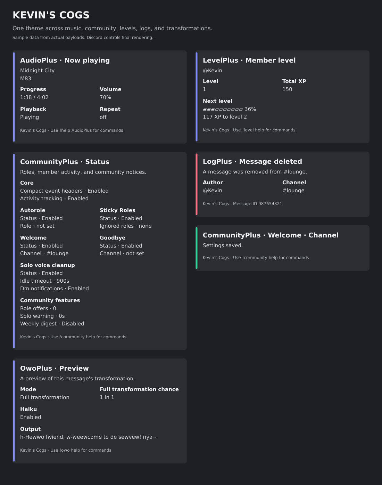

# Discord presentation

All eleven cogs use one visual theme for their own command replies, nested command help, input errors, event notices, and direct messages.

Every command and group also has a description for Red's native help formatter. The main help menu lists readable summaries, while help for a group or individual command includes its purpose, syntax, and relevant details.



This preview uses actual command and event payloads with sample data. It illustrates the theme; Discord controls the final layout, fonts, and emoji rendering.

## Design

| Element | Convention |
| --- | --- |
| Heading | `CogName · Section`, with the same naming pattern throughout. |
| Normal accent | Indigo, `#818CF8`. |
| Success / additions | Mint, `#34D399`. |
| Warning / changes | Amber, `#FBBF24`. |
| Error / destructive events | Rose, `#FB7185`. |
| Settings | Named sections, bold labels, working channel and role mentions. |
| Commands | Inline code with the server's actual prefix. |
| Footer | `Kevin's Cogs`, command guidance where applicable, and page numbers for long results. |
| Events | Existing timestamps, attribution, IDs, thumbnails, and compact-header preferences are retained. |

Settings confirmations are small success cards rather than checkmark reactions. AudioPlus has a sectioned command overview and a now-playing card. LevelPlus member cards show an avatar, total XP, level, and progress to the next level. OwoPlus previews separate transformation metadata from the output.

## Interactive controls

Audio now-playing panels update progress and offer Pause/Resume, Skip, Queue, and Stop buttons. Their clicks repeat current command/DJ/listener checks. Persistent community role menus check the current safe-role list and affect only selected configured roles. Personal role pickers and guided setup panels belong to the requester and server, expire after three minutes, and keep current Red permission and disabled-command rules.

Every cog offers guided setup using the same role/channel pickers and toggle controls. New command overviews include saved music, role menus, earned-XP controls, scopes, and delivery recovery. Output retains the common colors, headings, working mentions, pagination, and text fallback. Control expiration removes the active controls when Discord allows editing the message.

## Delivery and compatibility

Long descriptions and fields are paginated within Discord's individual and combined embed limits, counting UTF-16 units. Lists and transformed previews retain their complete text. Export attachments appear on the first delivered part only.

Command replies respect Red's embed preference. If the bot lacks **Embed Links**, replies use text with the same headings and sections. Channel notices also fall back to text when that permission is unavailable. The presentation preserves permission checks, command arguments, Config identifiers, defaults, and saved records. Public roots are now `community`, `level`, `log`, and `owo`; direct and slash shortcuts use the same theme and permission paths. Old root names are intentionally removed.

Custom welcome and goodbye templates keep their text and formatting inside the themed notice. Level-up templates remain message text paired with a level/XP card, retaining the bot's existing mention policy. Routine command responses and logs suppress mentions. OwoPlus webhook reposts keep their transformed content and original sender presentation. Red's global help command, permission-denial messages, and unexpected-exception reporting remain controlled by Red.

## Maintaining the theme

Each cog includes identical `presentation.py`, `interactive.py`, and `command_support.py` helpers so Red Downloader can install it independently. Edit the canonical copy in `audioplus`, then copy it to the other ten packages; the consistency test rejects drift. The helper owns colors, heading/footer styling, pagination, fallback text, confirmations, nested help, and input-error formatting. Individual cogs own their screen content and event semantics.

Regenerate the preview with the development dependencies installed:

```sh
python -m scripts.preview_presentation
```

The preview generator uses temporary Config storage and mocked Discord/Lavalink objects. It does not connect to or post on Discord.

The discovery additions use the same theme: music result selectors, poll/event attendance menus, achievement/challenge cards, locally rendered indigo rank PNGs, style previews, and history reports. Optional SettingsHub adds a requester-bound cog picker and restore preview. All eleven packages vendor identical presentation, command support, and interactive helpers.

## Optional server themes

SettingsHub provides `theme color` and `theme footer` for the current server. Normal replies, live music card edits, refreshed polls/events, PNG rank cards and delivery retries use the current brand and semantic colors. Log retries retain their original base card so a theme change does not lose error/success meaning. Pagination reserves room for a Unicode brand and page labels. Relevant daily playback/error DMs can use the monitored server theme. Replies still respect embed preferences and permissions. Unloading SettingsHub returns source cogs to default colors until the hub reloads.

Owo Undo uses a separate themed bot card: incoming webhooks cannot host bot component controls. Author-only controls expire after two minutes and original text is cleared on expiration, unload or user-data deletion. Explicit haiku submission/review/contest cards share the same presentation; raw webhook sender attribution remains tied to the original author.
